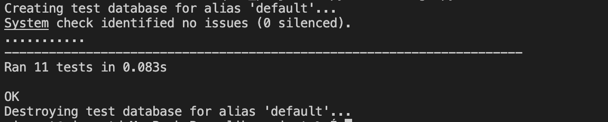

# qlik_project
This is a simple REST API utilized django rest framework and sqlite3 that is default come with Django framework. 
## Instruction
This API is JSON supported,  the only mandatory key in the object is 'message_content'
As you retriving message data, you will find 'message_id', 'is_palindrome', 'last_modified'. Those are automatically generated and updated by the system. Any input regards to above mentioned keys will be ignored. 

After you launch the project, nevigate to localhost:8000/messages in your browser, Django REST framework provided a visiable UI for this API so that users or developers can interact with. 

## Installation & Build
There are two ways to fire up and try this project locally. 
### Option 1: 
Clone down the entire project to your local, inside the project folder, run:
```
pip install -r requirements.txt
``` 
Then build and init the associated databse by running the following command: 
```
python3 manage.py makemigrations
python3 manage.py migrate
```
Finally, run 
```
python3 manage.py runserver
```
### Option 2: 
Clone down the entire project to your local, inside the project folder, make sure there is a running docker on your enviroment, simply run:
```
docker-compose up
``` 
## Testing
If you want to test the API, I have created a few test cases for this project, simply run 
```
python3 manage.py test
```
You will see the result and detailed of the failed cases if there is any



## API Documentation
```
GET messages/ -> return the message list
GET messages/<message_id> -> get the sepcific message by given message id
POST messages/ -> create a new message record and save in the database
DELETE messages/<message_id> -> delete the sepcific message by given message id
PATCH messages/<message_id> -> update the sepcific message contetn by given message id
```
